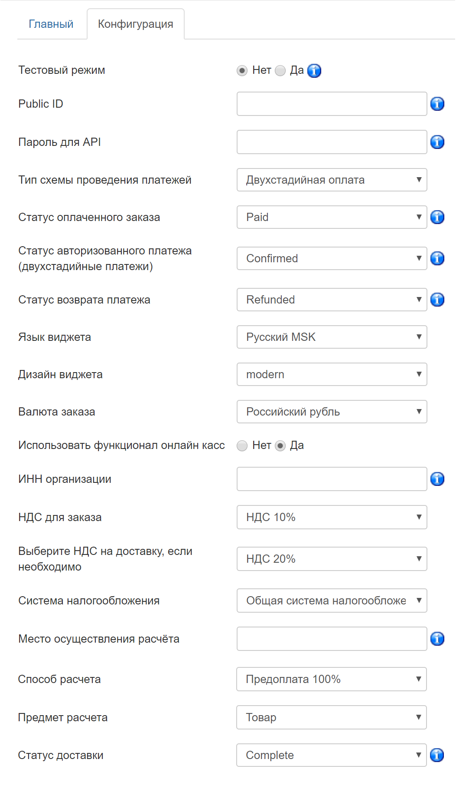

# CloudPayments module for Joomla -JoomShopping

Модуль позволит добавить на ваш сайт оплату банковскими картами через платежный сервис [CloudPayments](https://cloudpayments.ru/Docs/Connect). 
Для корректной работы модуля необходима регистрация в сервисе.
Порядок регистрации описан в [документации CloudPayments](https://cloudpayments.ru/Docs/Connect).

## Возможности

* Одностостадийная система;
* Поддержка онлайн-касс (ФЗ-54);
* Отправка чеков по email;
* Отправка чеков по SMS;
* Выбор локализации виджета оплаты.

## Совместимость:
JoomShopping v.4.15.0 и выше;  
Joomla v.3.8.2 и выше.

### Установка через панель управления

1. Зайдите в инсталлятор расширений "Расширения" -> "Менеджер расширений" -> "Установка" -> `/administrator/index.php?option=com_installer`  
и загрузить архив.

2. Далее в настройках модуля "Компоненты" -> "JoomShopping" -> "Опции" -> "Способо оплаты":\
`/administrator/index.php?option=com_jshopping&controller=payments`  
добавьте новый способ оплаты:
 
 **Обязательные пункты:**
* Название - **Cloudpayments**;
* Псевдоним и Имя скрипта - **pm_cloudpayments_cp**; 
* Тип оплаты - **Расширенный**.   
 

### Настройка модуля Cloudpayments

Далее перейдите в созданную платежную систему и измените настройки.

Вкладка "Конфигурация":

* **Public_id** - Public id сайта из личного кабинета CloudPayments;
* **Password for API** - API Secret из личного кабинета CloudPayments;
* **Статус оплаченного заказа** - Paid (Если не предусматривается другой функционал);
* **Статус возврата платежа** - Refunded (Если не предусматривается другой функционал);
* **НДС для заказа** - Укажите ставку НДС товаров;
* **Выберите НДС на доставку, если необходимо** - Укажите ставку НДС службы доставки;
* **Система налогооблажения** - Тип системы налогообложения;
* **Язык виджета** - Русский МСК (Если не предусматривается использовать другие языки);
* **Валюта заказа** - Русский рубль (Если не предусматривается использовать другие валюты);
* **Использовать функцуионал онлайн касс** - Включение/отключение формирования онлайн-чека при оплате.

В личном кабинете CloudPayments в настройках сайта необходимо включить следующие уведомления:

* **Check уведомление**: \
`http://domain.ru/index.php?option=com_jshopping&controller=checkout&task=step7&act=check_&js_paymentclass=pm_cloudpayments_cp&no_lang=1`
* **Pay уведомление**: \
`http://domain.ru/index.php?option=com_jshopping&controller=checkout&task=step7&act=pay_&js_paymentclass=pm_cloudpayments_cp&no_lang=1`
* **Refund уведомление**: \
`http://domain.ru/index.php?option=com_jshopping&controller=checkout&task=step7&act=refund_&js_paymentclass=pm_cloudpayments_cp&no_lang=1`
* **Confirm уведомление**: \
`http://domain.ru/index.php?option=com_jshopping&controller=checkout&task=step7&act=confirm_&js_paymentclass=pm_cloudpayments_cp&no_lang=1`

* **Cancel уведомление**: \
`http://domain.ru/index.php?option=com_jshopping&controller=checkout&task=step7&act=chancel_&js_paymentclass=pm_cloudpayments_cp&no_lang=1`

Где domain.ru — доменное имя вашего сайта. Кодировка — UTF-8, HTTP-метод — POST, формат — CloudPayments.

### Интеграция с онлайн-кассой

Сервис [CloudKassir](https://cloudkassir.ru) предоставляет в аренду онлайн-кассы для Вашего интернет-магазина на платформе [JoomShopping](https://github.com/EvgeniyTr/CMS-JoomShopping-CK) в соответствии требованиям ФЗ-54.  
Для корректной работы модуля необходима регистрация в сервисе.
Порядок регистрации описан в [документации CloudKassir](https://cloudkassir.ru/#subscribe).

